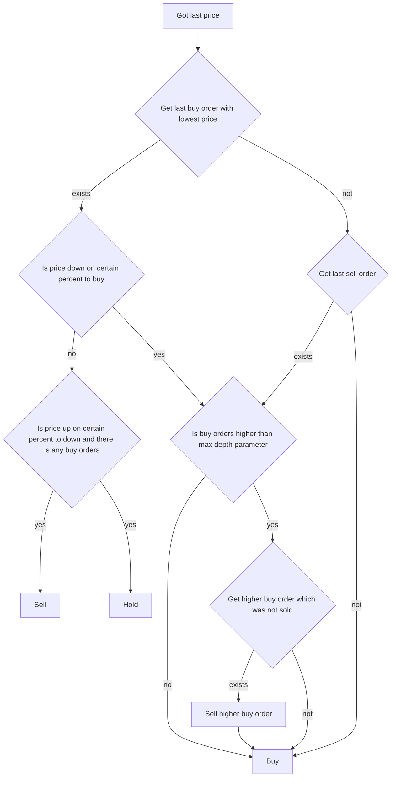

# BDTSTF

Main strategy idea is selling when there is certain of percentage profit of specific buy order reached. Every buy order make when price goes down and sell when price getting up.

Here are required parameters for `strategy_cfg` section.
* `name` must be in every config. This is how certain strategy is resolved while trader is starting
* `max_depth` is a maximum amount of buy orders are unbalanced by sell orders
* `lots_to_buy` lots to buy in one order
* `percent_down_to_buy` is a percent on which price should be down to buy.  
`!`Not fraction but true percent value. For example if 1.65% needed, use 1.65 not 0.0165.
* `percent_up_to_sell` is a percent on which price should be up to sell.
