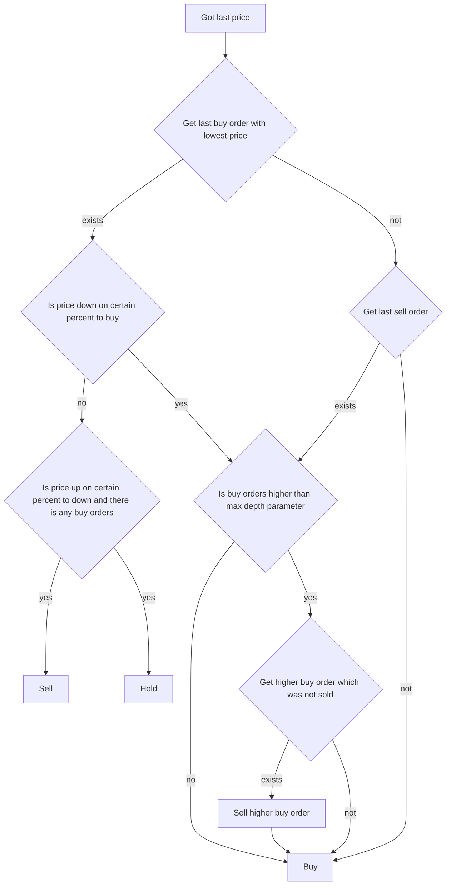

# BDTSTF

Main strategy idea is selling when there is certain of percentage profit of specific buy order reached. Every buy order make when price goes down and sell when price getting up.

```mermaid
graph TD
    A[Got last price] --> B{ Get last buy order with lowest price };
    B -- exists --> C{ Is price down on certain percent to buy };
    C -- no --> F{ Is price up on certain percent to down and there is any buy orders };
    C -- yes --> I;
    B -- not --> D{ Get last sell order };
    D -- exists --> I{ Is buy orders higher than max depth parameter };
    I -- no --> J;
    I -- yes --> K{ Get higher buy order which was not sold };
    K -- exists --> L[ Sell higher buy order ];
    K -- not --> J;
    L --> J;
    D -- not --> J[ Buy ];
    F -- yes --> G[ Sell ];
    F -- yes --> H[ Hold ];
```