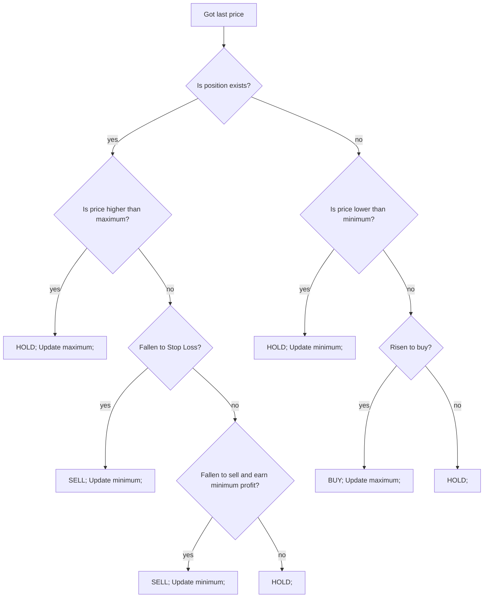

# Simple trade

Main idea is to buy when price raise from local minimum and sell when price fall from local maximum for a certain percent.

Here are required parameters for `strategy_cfg` section.
* `name` must be in every config. This is how certain strategy is resolved while trader is starting
* `lots_to_buy` lots to buy in one order
* `percent_raise_to_buy` is a percent on which price should rise from minimum to buy.  
* `percent_fall_to_sell` is a percent on which price should fall from maximum to sell.
* `percent_stop_loss` is a percent on which price should fall below minimum to sell
* `percent_minimum_profit` minimum profit to allow to sell when `percent_fall_to_sell` contition comes  
`!`Percent value expected is not a fraction but true percent value. For example if 1.65% needed, use 1.65 not 0.0165.